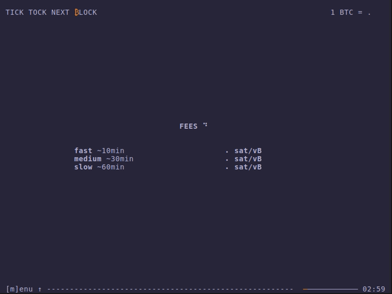

# tick-tock-tui

> TICK TOCK NEXT ₿LOCK

Get latest [Bitcoin](https://bitcoin.org) data in your terminal: `blocks`, `fees`, `ratio` and `prices` incl. a `price` converter.

Most data based on [Mempool REST API](https://mempool.space/docs/api/rest). [Kraken Spot Rest API](https://docs.kraken.com/api/docs/rest-api/get-ticker-information) is used as a price oracle to get latest prices other assets (needed to calculate ratio `BTC/Asset`).

BTW: Connect `tick-tock-tui` to your own Mempool instance if your like. Check [FAQ](./#faq).

## Preview

<a href="demo/tick-tock-demo.gif">
  
</a>


## Installation

soon


## CLI

```sh
tick-tock-tui --help

Usage: tick-tock-tui [-m|--mempool URL] [-r|--refresh SECONDS]
                     [-s|--storage DIRECTORY] [-i|--ignore]

  Get latest Bitcoin data in your terminal: fees, blocks, ratio and prices incl.
  a price converter. Most data are provided by Mempool. Connect to your own
  Mempool instance if you like. Latest prices of other assets coming from
  Krakens Spot API.

Available options:
  -m,--mempool URL         Mempool URL (default: "https://mempool.space")
  -r,--refresh SECONDS     Interval to auto-reload data in seconds
                           (default: 180)
  -s,--storage DIRECTORY   Folder to store application state
                           (default: "~/.local/state/tick-tock-tui")
  -i,--ignore              Ignore previous stored application state to use
                           default data instead.
  -h,--help                Show this help text
```

## Local development

### Requirements

#### Nix (recommended):

Install [`Nix`](https://zero-to-nix.com/start/install). Enable [`flakes`](https://zero-to-nix.com/concepts/flakes).

After that, `cd` into project directory to run `nix develop`. Check out available commands in a next chapter.

#### Others:

Following needs to be installed:

- [Haskell](https://www.haskell.org)
- [cabal](https://cabal.readthedocs.io)
- [cabal-fmt](https://github.com/phadej/cabal-fmt)
- [fourmoulu](https://github.com/fourmolu/fourmolu)
- [just](https://just.systems)

After installing everyting, check out available commands in next chapter.

#### Commands to build etc.

```sh
just --list

Available recipes:
    build              # build app
    format             # format files
    format-check       # check formats
    lint               # lint
    run                # run app
    run-custom url sec # run app with custom args (mempool url + seconds to refresh data)
    test               # run tests
```

## FAQ

#### How to connect to a custom Mempool instance?

Start the app with `-m` parameter:
```sh
cabal run tick-tock-tui -- -m {custom-mempool-url}
```

#### Do I need an API key to get asset price data from Kraken's API?

Nope. Quote from [Kraken Support page](https://support.kraken.com/hc/en-us/articles/360000919966-How-to-create-an-API-key):

> "API keys are not required to call the market data (public) API endpoints, as the market data endpoints are not associated with any specific Kraken account."

#### Any data are stored locally?

Yes, users settings are stored locally. That's needed to start the app with latest user settings. Locations to persist data are defined by [`XdgState`](https://hackage.haskell.org/package/directory/docs/System-Directory.html#v:XdgState):
- non-Windows `~/.local/state/tick-tock-tui/data{version}.json`
- Windows: `%LOCALAPPDATA%` (e.g. `C:/Users/<user>/AppData/Local/tick-tock-tui/data{version}.json`)

## License

[MIT License](./LICENSE)
