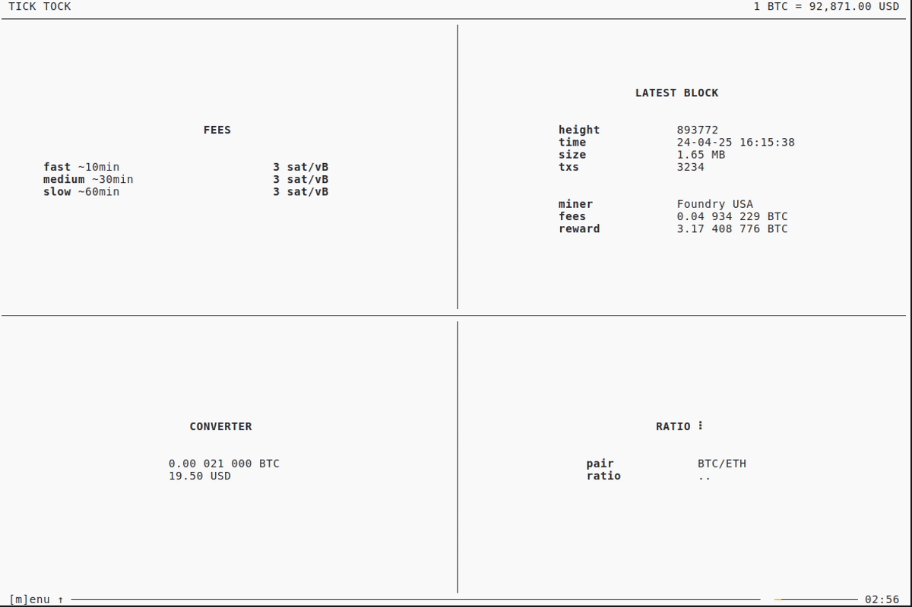
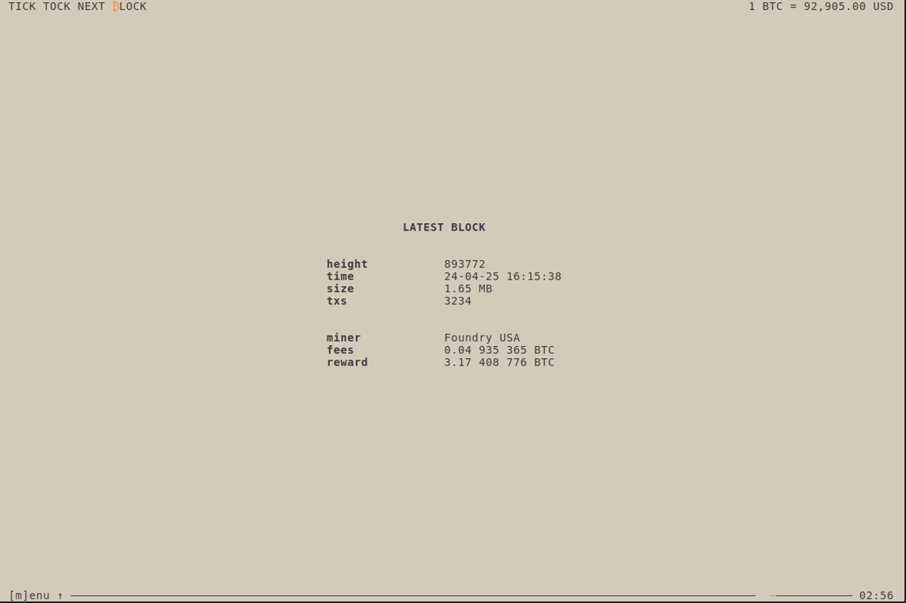
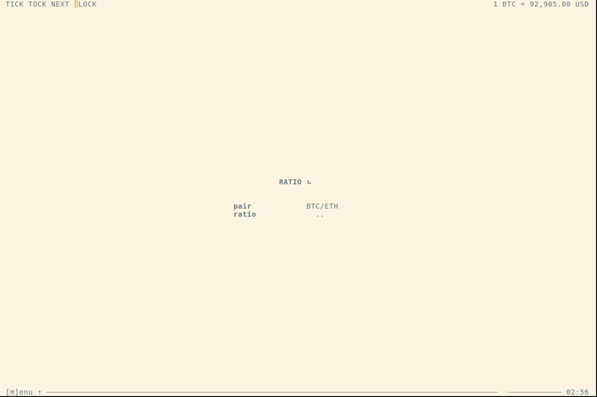

# tick-tock-tui

> TICK TOCK NEXT ₿LOCK

Get the latest [Bitcoin](https://bitcoin.org) data in your terminal and more:
- Latest `block`
- Latest `fees`
- `price` converter
- `ratio` of any `BTC/Asset` pair

Switch between `BTC`, `sat` and up to 7 `Fiat` currencies.

# Table of Contents

- [Preview](./#preview)
- [CLI](./#cli)
- [Keybindings](./#keybindings)
- [Installation](./#installation)
- [Development](./#development)
- [FAQ](./#faq)
- [License](./#license)

# Preview

_(theme depends on your terminal preferences btw)_

## Dashboard

<a href="demo/dashboard.gif">
  
</a>

## Latest fees

<a href="demo/fees.gif">
  
</a>

## Latest block

<a href="demo/block.gif">
  
</a>

## Price converter

<a href="demo/converter.gif">
  
</a>

## Ratio `BTC/Asset`

<a href="demo/ratio.gif">
  
</a>

## Menu

<a href="demo/menu.gif">
  
</a>

# CLI

```sh
tick-tock-tui --help

Usage: tick-tock-tui [-m|--mempool URL] [-r|--refresh SECONDS]
                     [-s|--storage DIRECTORY] [-i|--ignore]

  Get the latest Bitcoin data in your terminal: fees, blocks, ratio and prices
  incl. a price converter. Most data is provided by Mempool. Connect to your own
  Mempool instance if you like. Latest prices of other assets come from Krakens
  Spot API.

Available options:
  -m,--mempool URL         Mempool URL (default: "https://mempool.space")
  -r,--refresh SECONDS     Interval to auto-reload data in seconds
                           (default: 180)
  -s,--storage DIRECTORY   Folder to store application state
                           (default: "~/.local/state/tick-tock-tui")
  -i,--ignore              Ignore previous stored application state to use
                           default data instead.
  -h,--help                Show this help text
```

# Keybindings

## Menu

| Key | Description |
| --- | --- |
| <kbd>↑</kbd> / <kbd>↓</kbd> or <kbd>m</kbd> | Toggle menu |

## Screens

| Key | Description |
| --- | --- |
| <kbd>0</kbd> | Dashboard |
| <kbd>1</kbd> | Fees |
| <kbd>2</kbd> | Block |
| <kbd>3</kbd> | Price converter |
| <kbd>4</kbd> | Ratio |

## Actions

| Key | Description |
| --- | --- |
| <kbd>r</kbd> | Reload data |
| <kbd>s</kbd> | Toggle BTC/sat |
| <kbd>t</kbd> | Toggle Fiat |
| <kbd>e</kbd> | Toggle extra information |
| <kbd>a</kbd> | Toggle animation |
| <kbd>q</kbd> | Quit |

## Edit mode (converter + ratio only)

| Key | Description |
| --- | --- |
| <kbd>Ctrl</kbd> + <kbd>e</kbd> | Enter edit mode |
| <kbd>ENTER</kbd> | Apply changes (in edit mode only) |
| <kbd>ESC</kbd> | Skip changes (in edit mode only) |


# Installation

## Cabal

Run following command from your project directory

```sh
cabal install
```

## Nix

### NixOS

soon

### Home Manager

soon

# Development

## Requirements

### Nix (recommended):

Install [`Nix`](https://zero-to-nix.com/start/install). Enable [`flakes`](https://zero-to-nix.com/concepts/flakes).

`cd` into project directory to run `nix develop`. Check out available commands in a next chapter.

### Others:

Following needs to be installed:

- [Haskell](https://www.haskell.org)
- [cabal](https://cabal.readthedocs.io)
- [cabal-fmt](https://github.com/phadej/cabal-fmt)
- [fourmoulu](https://github.com/fourmolu/fourmolu)
- [just](https://just.systems)

When everything is installed, check out all the commands available below.

### Commands to build etc.

```sh
just --list

Available recipes:
    build              # build app
    format             # format files
    format-check       # check formats
    lint               # lint
    run                # run app
    run-custom url sec # run app with custom args (mempool url + seconds to refresh data)
    test               # run tests
```

### Build demos

Check instructions [here](./demos/README.md).

# FAQ

### Where all the data is coming from?

Most data is fetched from [Mempool REST API](https://mempool.space/docs/api/rest). Connect to your private Mempool instance if you like (see next question).

To calculate a `BTC/Asset` ratio [Kraken Spot Rest API](https://docs.kraken.com/api/docs/rest-api/get-ticker-information) is used to get latest prices for other assets.

### How to connect to a custom Mempool instance?

Start the app with `-m` parameter:

```sh
cabal run tick-tock-tui -- -m {custom-mempool-url}
```

### Do I need an API key to get asset price data from Kraken's API?

Nope. Quote from [Kraken Support page](https://support.kraken.com/hc/en-us/articles/360000919966-How-to-create-an-API-key):

> "API keys are not required to call the market data (public) API endpoints, as the market data endpoints are not associated with any specific Kraken account."

### Is any data stored locally?

Yes, users settings are stored locally. That's needed to start the app with the latest user settings. Locations to persist data are defined by [`XdgState`](https://hackage.haskell.org/package/directory/docs/System-Directory.html#v:XdgState):

- non-Windows `~/.local/state/tick-tock-tui/data{version}.json`
- Windows: `%LOCALAPPDATA%` (e.g. `C:/Users/<user>/AppData/Local/tick-tock-tui/data{version}.json`)

# License

[MIT License](./LICENSE)
